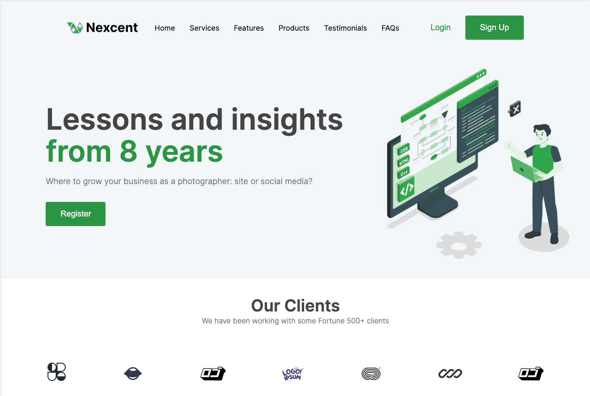

https://www.figma.com/file/qDfvdpQkp1i6XfkxVrJegB/Responsive-Landing-Page-Design-%7C-Website-Home-Page-Design-%7C-Agency-Website-UI-Design-(Community)?type=design&node-id=0-1&mode=design&t=2t472Ub1XMlNqQJC-0 

# Nexcent [Landing Page]

### Description: 

Nexcent is a mock landing page created based on a Figma design. This project serves as a showcase of my skills as a front-end developer. It demonstrates my ability to build reusable UI components following the ATOM methodology with precision and attention to detail. 

### Screenshot: 

### Technologies Used: 
Built using: 
- Next.js 
- Emotion 

### Installion: 
To get started, clone the repository and install the required dependencies by running:
`npm i `

To run the project locally, use the following command:
`npm run dev`

------

Built by Alice West |  https://github.com/alicewestcreate